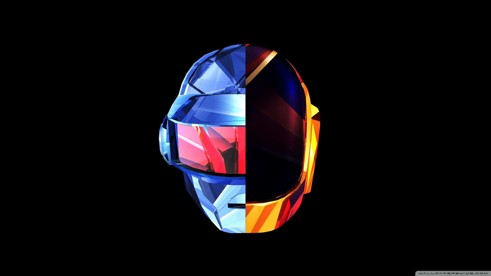

## Hi!

My name is Nik and I like to program and do research. The 
intention of this site is for you to be able to have a better
understanding of me and, if you want, contact me directly.

Picture of me bouldeirng ^

I am Bulgarian by nationality, but grew up in Belgium for the 
first six years and then moved to Latvia until the adulthood. I
speak five languages (Bulgarian, English, Latvian, Russian, French) and aspire one day to learn 10.

## Hobbies

### Cooking 

Since I was fourteen I loved to cook my own food. Ever since then I 
have been trying to explore beyond western cuisines and dwell 
more into eastern cusines. My current craving has been Desi 
food, as I was recently in Pakistan. 

Overall, I'd say that my best dish is lasagna, since every time 
I make it for somoene new, they always ask me for the recipe 
or for me to make it again for them (especially my parents). 

### Bouldering 

For the last three years I have been bouldering. My top ascend 
was a v6+ (I think). My main goal would be to do a euro-trip by
car with some friends where we would go outdoor bouldering and 
camping. I like to use the kilter board but am very bad at it. 
Because bouldering on video does not seem very cool, here is a 
video of my most proud dyno!

### Software Development

On the side, I like to build software for myself and others. On 
top of the random cli apps that I build that no one else uses I 
have some apps, that I would like to share. I mainly make 
android and desktop softwares which can be found in the projects tab.

MEOW MEOW MEOW
