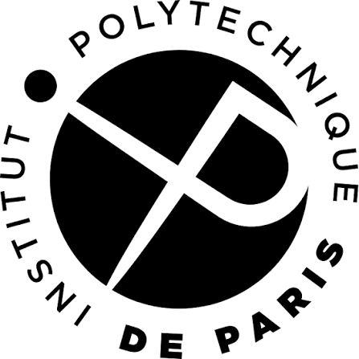
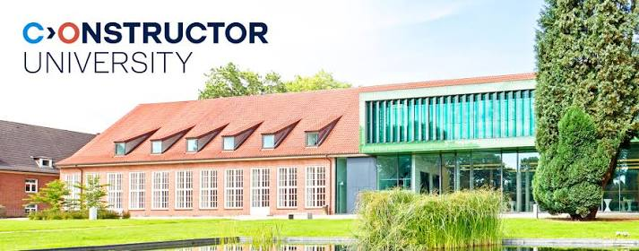
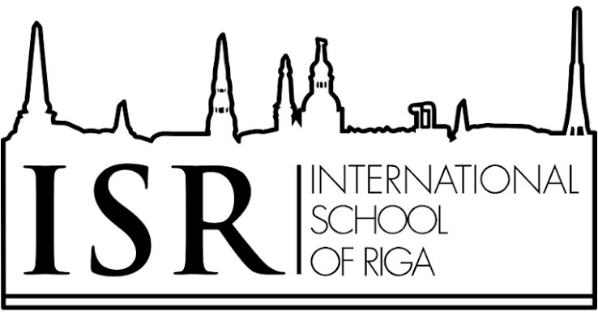

## Education

### Masters

Currently, I am pursuing a master in informatics with a 
specialisation in parallel and distributed systems at the 
[Institut Polytechnique de Paris](https://www.ip-paris.fr/). My 
main goal is to contribute postiviely and meaningfully to the 
research field of distributed systems. 
I am also intersted in HPC simulation software and HPC for 
bio-informatics. 

My main goal with this degree would be to find a more specific area of research to focus on and hopefully extend my studies at the IPP to a full PhD program, but only time will tell...

 !NOTE: Put this on the right and the other text on the LEFT.

### Bachelors 

I finished my bachelor's degree at [Constructor University 
Bremen]() (formely known as Jacobs University) with a BSc in 
informatics. The campus and the people there were wonderful and 
the university is every growing. There is where I became 
passionated about distributed systems and becasue of the 
professors and their high quality teaching and help, was I able
to get in the IPP. To them I will always be thankfull. 

### High school 

I finished my highschool education at the [International School
of Riga](). I graduated with a local latvian acredited degreee
and with the IBDP. I was awarded an award for my high grades by 
the (then priminister). For those intersted, my HLs were in: 
history, economoics and english, and my SLs were in: 
mathematics, informatics and french. Originally I thought I 
would be an ecnomist and last second decided to become a 
computer scientist because I like programming that much.

